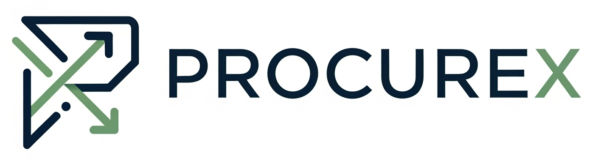
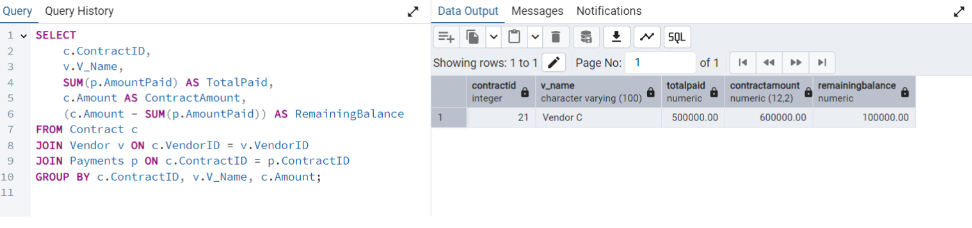

   

<h1 align="center">Tender Management System 📈</h1>

  
  
  

---

## 🌟 Project Overview

This **Tender Management System** is a sophisticated database project developed for my DBMS coursework at **Dhirubhai Ambani University**. It provides a comprehensive solution for managing the entire tender process, from initial creation and vendor bidding to contract awarding and payment tracking. The system is meticulously designed to ensure data integrity, efficiency, and transparency in procurement operations.

## ✨ Key Features & Functionality

**End-to-End Tender Management:** Facilitates the complete lifecycle of tenders, bids, contracts, and payments, ensuring a seamless workflow.

**Automated Vendor Risk Management:** Implements intelligent triggers to automatically `red-flag` and `block` vendors with a history of abandoned contracts, enhancing procurement security. This also automatically deletes their ongoing bids.

**Dynamic Bid Evaluation:** Features a trigger that automatically evaluates newly submitted bids, determining initial approval status based on vendor standing and assigning an Audit Committee member for oversight.

**Robust Data Model:** Engineered with a well-normalized relational schema (primarily BCNF and 3NF) to guarantee data consistency and optimize query performance.

**In-depth Reporting & Analytics:** Provides a suite of powerful SQL queries for generating critical insights, including tender summaries, payment statuses, vendor performance, and budget savings.

## 📊 Database Design & Structure

The system's foundation is built upon a carefully designed Entity-Relationship (ER) model, translated into a robust relational schema.

### Relational Schema Highlights

Below are some of the core tables in our database, demonstrating primary and foreign key relationships for data integrity:

**Tender:** `TenderID` (PK), `T_Name`, `Description`, `Status`, `Budget`, `Deadline`.

**Vendor:** `VendorID` (PK), `V_Name`, `Contact`, `CompletedContracts`, `IsRedFlagged`.

**Bids:** `BidID` (PK), `BidAmount`, `TenderID` (FK), `VendorID` (FK), `EvalID` (FK).

**Contract:** `ContractID` (PK), `TenderID` (FK), `VendorID` (FK), `ContractStatus`, `Amount`.

**Payments:** `{ContractID, PaymentID}` (Composite PK), `AmountPaid`, `PaymentDate`.

*(For a complete list of tables and their attributes, please refer to the `G5_T12_DBMSProject.pdf`.)* 

## 🛠️ Implementation Details

The project leverages PostgreSQL for its robust features and reliable performance.

### DDL & DML Scripts

All table creations, constraints, and initial data insertions are managed via SQL Data Definition Language (DDL) and Data Manipulation Language (DML) scripts. These are available in the repository.

### Automated Triggers
`trg_redflag_check`: Manages vendor blacklisting based on abandoned contracts.

`trg_auto_eval_bid`: Automatically initiates bid evaluations upon new bid submission.

## 🔍 Sample Query Outputs

Experience some of the insights generated by our system:

### Tender Summary Report
A high-level overview of tenders, including evaluation counts and contract award status.

 ### Payment Status & Remaining Balance
Track payment progress for awarded contracts.

*(More query examples and their outputs can be found in the full project report.)*

## 🚀 Future Enhancements

We envision expanding this system with:

**Advanced User Management:** Implementing full Role-Based Access Control (RBAC) with secure user authentication for distinct roles (admin, vendor, auditor)

**Interactive Dashboards:** Developing a comprehensive analytics dashboard for real-time insights into vendor performance (e.g., bid win rates, fulfillment rates, red-flag trends) using charts and graphs.

**Automated Notifications:** Integrating email/SMS alerts for key events like new tender postings, deadline reminders, and bid results.
